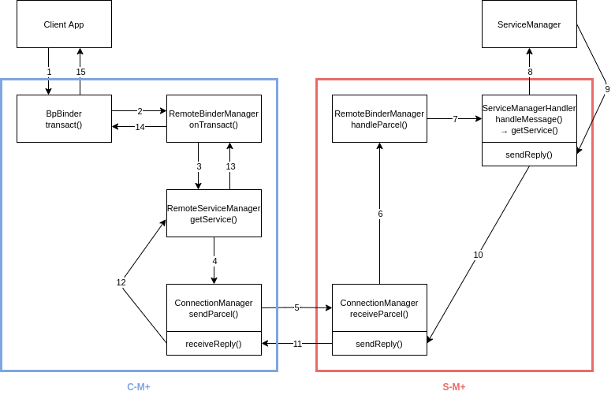

# MobilePlus

Paper: [MobiSys '17] Mobile Plus: Multi-device Mobile Platform for Cross-device Functionality Sharing (http://cps.kaist.ac.kr/papers/mobisys17-mobileplus.pdf)

## Quickstart

MobilePlus was implemented as a form of system service for AOSP. We added/modified some source codes in following directories (. represents root directory of AOSP source tree): 

### Newly Added Code

./frameworks/mobileplus

### Modification in Existing AOSP Code

./frameworks/base/core/java/android
./frameworks/base/service/core/java/com/android/server
./frameworks/native/libs/binder

### AOSP Build & Flash

  - Build Machine: Ubuntu 18.04.3 LTS x64
  - Smartphones: Two Google Pixel 4 XLs
  - AOSP Version: 10.0.0_r9
  - Proprietary Binary: Pixel 4 XL "Vendor Image" (by Google) QD1A.190821.011.C4
  - Apply M+ patch to the original AOSP source tree and build&flash to each Pixel 4 XL device

### How to Partially-Build ./frameworks/mobileplus directory ONLY

```
$ cd ./frameworks/mobileplus
$ mm
$ adb push ./out/target/product/coral/system/bin/mobileplus_manager /system/bin/
$ adb push ./out/target/product/coral/system/lib64/libmobileplus.so /system/lib64/
```

### Launching and Testing MPLUS Features

Before launching M+, make sure that the app or service you want to share across devices is registered to RemoteBinderManager's SharingMap before launching M+.

Start mplus service in server device:

```
$ adb -s [server device] shell setenforce 0
$ adb -s [server device] shell /system/bin/mobileplus_manager server
```

Start mplus service in client  device:

```
$ adb -s [client device] shell setenforce 0
$ adb -s [client device] shell /system/bin/mobileplus_manager [server's IP]
```

After these steps, you can test M+’s functionality sharing features across multiple devices.

## Important Classes in MobilePlus

  - RemoteBinderManager: performs a core role within M+. It redirects parcels to the appropriate part of M+ and maintains required information for such redirections.
  - ConnectionManager: takes charge of the TCP network communication between C-M+ and S-M+.
  - Remote[Activity / ActivityTask / Package / Service ]Manager: runs on C-M+ and it represents Activity / ActivityTask / Package / Service ]Manager on the opponent(server) device.
  - [ Activity / ActivityTask / Package / Service]ManagerHandler: runs on S-M+ and it represents [ Activity / ActivityTask / Package / Service]Manager on its(server) device.
  - ServiceThread: runs on C-M+ and it represents a specific service on the opponent(server) device.
  - RemoteProxy: runs on S-M+ and it represents a specific service on its(server) device.

## Initial Pairing

  1. In a server device, mobileplus_manager binary will start from main() function in ./frameworks/mobileplus/cmds/mobileplus_manager.cpp.
  1. RemoteBinderManager::instantiate() registers M+ to the system service list and then creates SenderThread and ListenThread (These threads are required by ConnectionManager).
  1. In a client device, the same process is performed. After this, the client connects to the server device and then executes ConnectionManager::sendBasicServiceHandle().
  1. Two devices run sendBasicServiceHandle() once and share information about [ Activity / ActivityTask / Package / Service]Manager of each other.

## M+ Operation (Ex. Dealing with getService seed parcel)



  1. BpBinder::transact() intercepts a seed parcel (request parcel) from the app in a client device. In this example, the seed parcel contains a request for a binder object of the specific system service and this parcel was heading for Android ServiceManager.
  1. BpBinder::transact() redirects the seed parcel to RemoteBinderManager of C-M+.
  1. RemoteBInderManger sends the seed parcel to RemoteServiceManager. It represents the REAL Android ServiceManager in the server device.
  1. ConnectionManager obtains the seed parcel and does some wrapping for S-M+.
  1. The seed parcel is transmitted from C-M+ to S-M+ via TCP connection.
  1. ConnectionManager passes the parcel to RemoteBinderManager.
  1. ServiceManagerHandler takes the role of intermediating between S-M+ and Android ServiceManager.
  1. Android ServiceManager processes the seed parcel from the client app and generates a corresponding reply parcel.
  1. ServiceManagerHandler obtains the reply parcel and performs some parameter handling, if required.
  1. Reply parcel goes to ConnectionManager.
  1. The reply parcel is transmitted back to the client side via TCP connection.
  1. RemoteServiceManager performs some parameter handling, if required.
  1. The reply parcel is transmitted back towards the client app.
  1. The reply parcel is transmitted back towards the client app.
  1. Finally, the client app receives the reply corresponding to the seed parcel (request parcel).

